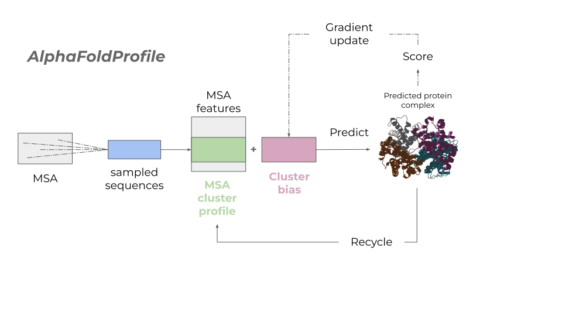
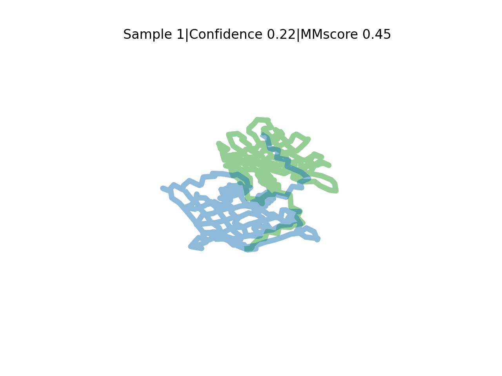

# AFProfile
Improved protein complex prediction with AlphaFold-multimer by denoising the MSA profile.
\
\
AFProfile learns a bias to the MSA representation that **improves the predictions** by performing **gradient descent through the AlphaFold-multimer network**. \
We effectively denoise the MSA profile, similar to how a blurry image would be sharpened to become more clear. \
This proves to be a highly efficient process, resulting in a 60-fold speedup compared to AFsample and as efficient as AFM v2.3. \
Read more about it in the paper [here](https://journals.plos.org/ploscompbiol/article?id=10.1371/journal.pcbi.1012253).

\

\
\
AlphaFold2 (including AlphaFold-multimer) is available under the [Apache License, Version 2.0](http://www.apache.org/licenses/LICENSE-2.0) and so is AFProfile, which is a derivative thereof.  \
The AlphaFold2 parameters are made available under the terms of the [CC BY 4.0 license](https://creativecommons.org/licenses/by/4.0/legalcode) and have not been modified.
\
**You may not use these files except in compliance with the licenses.**

## Optimisation for 6nnw
- Here is an example trajectory for PDBID 6nnw sorted by confidence.



- The final prediction has an MMscore of 0.96 compared to 0.44 using AF-multimer. The [native structure](https://www.rcsb.org/structure/6NNW) is in grey.


The confidence used to denoise the MSA is defined as: \
Confidence = 0.8 iptm + 0.2 ptm \
Where iptm is the predicted [TM-score](https://zhanggroup.org/TM-score/) in the interface and ptm that of the entire complex.

# Setup

## Clone this repository
```
git clone https://github.com/patrickbryant1/AFProfile.git
```

## Get the AlphaFold-multimer parameters
```
cd AFProfile
mkdir data/params
wget https://storage.googleapis.com/alphafold/alphafold_params_2022-03-02.tar
tar -xvf alphafold_params_2022-03-02.tar
mv params_model_1_multimer_v2.npz data/params/
rm *.npz
rm alphafold_params_2022-03-02.tar
```

## Install the AlphaFold requirements

Install all packages into a conda environment (requires https://docs.conda.io/en/latest/miniconda.html)
```
conda env create -f afprofile.yml
wait
conda activate afprofile
pip install --upgrade "jax[cuda12_pip]" -f https://storage.googleapis.com/jax-releases/jax_cuda_releases.html
pip install --upgrade numpy
```

## Try the test case
Now when you have installed the required packages - you can run a test case on CASP15 target T1123o
\

```
cd src
bash AFP.sh
```

## Install the genetic search programs
- We install the genetic search programs from source. This will make the searches faster.

*hh-suite*
```
cd src
mkdir hh-suite
cd hh-suite
wget https://github.com/soedinglab/hh-suite/releases/download/v3.3.0/hhsuite-3.3.0-SSE2-Linux.tar.gz
tar xvfz hhsuite-3.3.0-SSE2-Linux.tar.gz
cd ..
```

*hmmer*
```
cd src
wget http://eddylab.org/software/hmmer/hmmer.tar.gz
tar -xvzf hmmer.tar.gz
rm hmmer.tar.gz
cd hmmer-*
./configure
make
cd ..
```

*kalign*
```
wget https://github.com/TimoLassmann/kalign/archive/refs/tags/v3.3.2.tar.gz
tar -zxvf v3.3.2.tar.gz
rm v3.3.2.tar.gz
cd kalign-3.3.2/
./autogen.sh
bash configure
make
make check
make install
cd ..
```


## Download all databases for AlphaFold
- If you have already installed AlphaFold, you don't need to do this. Then you can simply
provide the paths for the databases in the runscript.

*Small BFD: 17 GB*
```
wget https://storage.googleapis.com/alphafold-databases/reduced_dbs/bfd-first_non_consensus_sequences.fasta.gz
gunzip bfd-first_non_consensus_sequences.fasta.gz
mkdir data/small_bfd
mv bfd-first_non_consensus_sequences.fasta data/small_bfd
rm bfd-first_non_consensus_sequences.fasta.gz
```

*UNIREF90: 67 GB*
```
wget https://ftp.ebi.ac.uk/pub/databases/uniprot/uniref/uniref90/uniref90.fasta.gz
gunzip uniref90.fasta.gz
mkdir data/uniref90
mv uniref90.fasta data/uniref90/
rm uniref90.fasta.gz
```

*UNIPROT: 105 GB*
```
wget https://ftp.ebi.ac.uk/pub/databases/uniprot/current_release/knowledgebase/complete/uniprot_trembl.fasta.gz
wget https://ftp.ebi.ac.uk/pub/databases/uniprot/current_release/knowledgebase/complete/uniprot_sprot.fasta.gz
gunzip uniprot_trembl.fasta.gz
gunzip uniprot_sprot.fasta.gz
mkdir data/uniprot
cat uniprot_sprot.fasta >> uniprot_trembl.fasta
mv uniprot_trembl.fasta data/uniprot/uniprot.fasta
rm *.gz
rm uniprot_sprot.fasta
```

- The following template databases are not used for the predictions, but needed due to the feature processing.

*PDB SEQRES: 0.2 GB*
```
wget https://files.rcsb.org/pub/pdb/derived_data/pdb_seqres.txt.gz
gunzip pdb_seqres.txt.gz
mkdir pdb_seqres
mv pdb_seqres.txt  pdb_seqres/
```

*MGNIFY: 120 GB*
```
wget https://storage.googleapis.com/alphafold-databases/v2.3/mgy_clusters_2022_05.fa.gz
gunzip mgy_clusters_2022_05.fa.gz
mkdir mgnify
mv mgy_clusters_2022_05.fa mgnify/
rm mgy_clusters_2022_05.fa.gz
```

*MMCIF: 238 GB*
- This may take a while...
```
mkdir -p data/pdb_mmcif/raw
mkdir data/pdb_mmcif/mmcif_files
rsync --recursive --links --perms --times --compress --info=progress2 --delete --port=33444 rsync.rcsb.org::ftp_data/structures/divided/mmCIF/ data/pdb_mmcif/raw

find data/pdb_mmcif/raw -type f -iname "*.gz" -exec gunzip
find data/pdb_mmcif/raw -type d -empty -delete  
for subdir in data/pdb_mmcif/raw/*
do
  mv "${subdir}/"*.cif data/pdb_mmcif/mmcif_files/
done
find data/pdb_mmcif/raw -type d -empty -delete
```

#Citation
Bryant P, Noé F. Improved protein complex prediction with AlphaFold-multimer by denoising the MSA profile. PLoS Comput Biol. 2024;20: e1012253.
